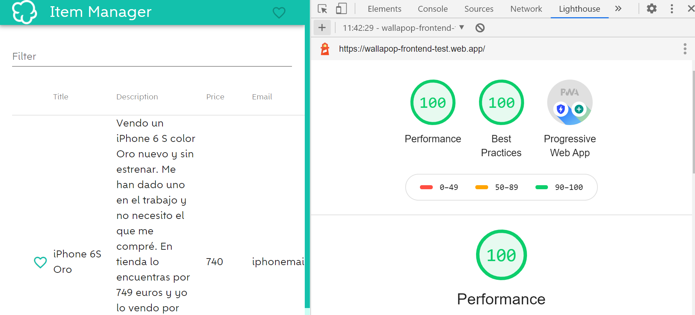

#  Wallapop Frontend Test

This project was generated with [Angular CLI](https://github.com/angular/angular-cli) version 10.0.6.

## Instructions

If you don't want to install and execute this application you have a deployed version over [here](https://wallapop-frontend-test.web.app/)

### install dependencies

Run `npm install`, it can take several minutes.

### Development server

Run `ng serve` for a dev server. Navigate to `http://localhost:4200/`. The app will automatically reload if you change any of the source files.

### Build

Run `ng build --prod` to build the project. The build artifacts will be stored in the `dist/` directory. Use the `--prod` flag for a production build.

## Testing
Default Angular testing tools have been replaced: 

* Jasmine > Jest: Simplest, fastest and save unit testing.
* Protractor > Cypress: Evolved e2e testing.

### Running unit tests

Run `npm run test` to execute the unit tests via [Jest](https://jestjs.io/).

Run `npm run test:coverage` to get test coverage.

Note: Only services have been unit tested.

## Running end-to-end tests

Run `npm run cypress` to execute the end-to-end tests via [Cypress](https://www.cypress.io/):

* Cypress Dashboard should appear
* You can execute your preferred e2e test or all of them.
  
    
## Key points

### Code structure

This is the code structure for this project: 

* cypress folder: e2e testing necessities
* app component / module: Application entry point, the main component
* components: there are two important components: item-list and favorite-list
* services folder: it contains all required services for this application
* assets: It contains all assets (images and fonts).

### UI

Selected UI Kit is angular material. It is base on Google Material Design and contains high quality components, and is so versatile.

Angular material allows us to define the theme color. For this project, the theme color has been adapted to wallapop colors. 
You can check those colors within the styles.scss file. 

Wallapop font family has been applied too.

### Concerns

#### Filter base component

Because Item list and favorite list components require filtering, these components extends abstract FilterBaseComponent class.

```typescript
export abstract class FilterBaseComponent {
  protected _search$: Subject<string> = new Subject<string>();

  applyFilter(searchTerm: string = '') {
    this._search$.next(searchTerm);
  }
}
```

This class exposes:
* _search$ stream to be able to react to new searches.
* applyFilter: this method is required to apply any search.

#### Reactive patterns

Few reactive patterns have been applied: 

* Don't unsubscribe: destroy service helps us to apply this pattern to our favorite list component. Every time favorite list is open, a subscription is performed. In order to avoid memory leaks, this subscription is kept until destroy service emits, this is until its tear down (OnDestroy life cycle hook).
* Streams combination: Search service combines to streams (data source, and filtering streams) and applies filtering to this combination. A debounce time is applied for performance.

#### Taking advantage of Angular Injection Tokens

To make a reusable search service, we provide via DI all necessary info to it, using the *FILTERING_DATA* Token. This token reveals the FilteringData data structure in order to define what data source and filter function we want to apply.

Any of our components have its own SearchService instance, then we can define a custom FilteringData for each scenario. 

### Performant Application and PWA

I have applied some changes in order to get a Performant application and PWA.

You can check results using Chrome lighthouse tool: 

